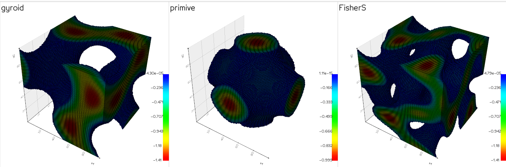

# TPMS-interpolatoin

In this rep, Deepsdf (with an AutoDecoder) is trained to give an interpolation representation for Minimal surfaces. To see the NN architecture see [this](./model/) file.
The attempt is to have an interpolation between minimal surfaces like Gyroid,Primitive, FisherS. 

The trained model finds the results like bellow:

Code (1,0,0), (0,1,0) and (0,0,1) are Gyroid, primitive and Fisher respectively.  
There are some limitations in terms of this interpolation.
- The volumes should be continous,
- The volumes should be symetrical in all axes.
